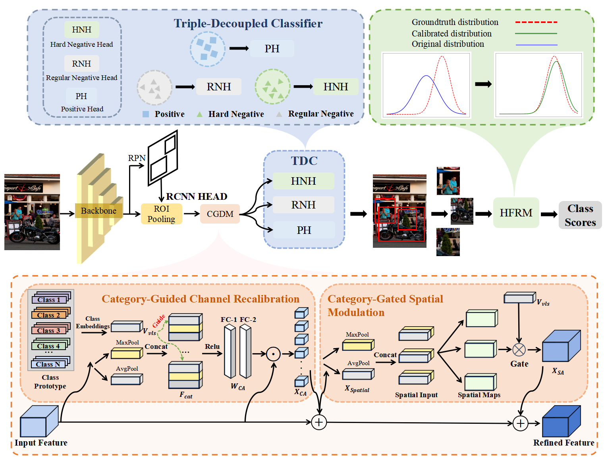
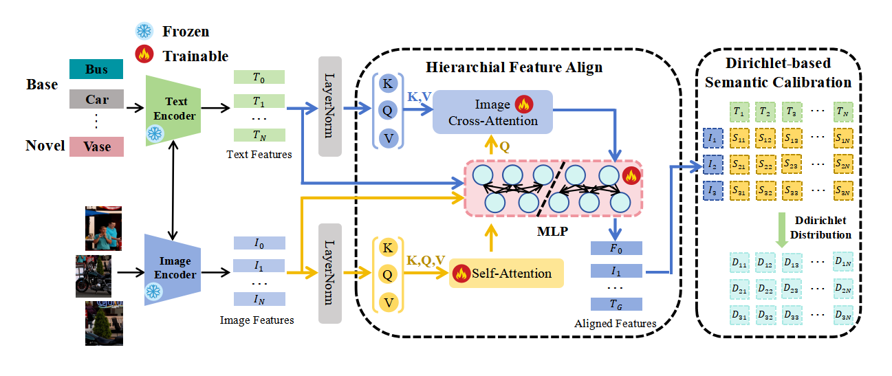
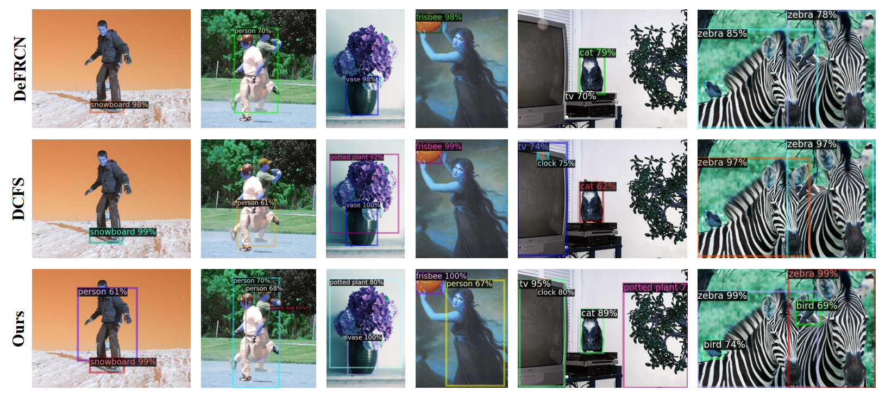

# 🔥 **README**

# SADN: Semantic-Aligned Decoupled Network for Few-Shot Object Detection

Official PyTorch implementation of our paper:
**“SADN: Semantic-Aligned Decoupled Network for Few-Shot Object Detection”**

---

## 🏗 Framework Overview 


<p align="center">
  
</p>
<p align="center">
  
</p>

---

## 📦 Installation

### 1. Clone this repo

```bash
git clone https://github.com/GZU-SAMLab/SADN.git
```

### 2. Create environment

```bash
conda create -n sadn python=3.8 -y
conda activate sadn
```

### 3. Install dependencies

```bash
pip install -r requirements.txt
```

### 4. Install Detectron2 (0.3)

```bash
pip install 'git+https://github.com/facebookresearch/detectron2.git'
```


## 🧪 Training and Evaluation

### **To reproduce the FSOD results on COCO**

```bash
bash run_coco_fsod.sh r101 8 sadn
```

### **To reproduce the FSOD results on VOC**

```bash
bash run_voc_fsod.sh r101 8 sadn
```

---

## 📥 Pretrained Weights

| Dataset   | Model Weghts|
| :---: |:---: | 
| COCO-Base | [model](https://pan.quark.cn/s/68e8530ee6c6) | 
| VOC-Base1 | [model](https://pan.quark.cn/s/2b0ed478f47d) | 
| VOC-Base2 | [model](https://pan.quark.cn/s/a918cc33f3bd) | 
| VOC-Base3 | [model](https://pan.quark.cn/s/cbe9b6e3fd8d)| 


---


---

## 📊 Experimental Results


### COCO Few-Shot (nAP)

<p align="center">
   


</p>

### VOC Few-Shot (mAP50)

<p align="center">
  


</p>

### Detection Visualization

<p align="center">
  
</p>

---


---

## 🤝 Acknowledgements

This project is built on [Detectron2](https://github.com/facebookresearch/detectron2) and [DeFRCN](https://github.com/er-muyue/DeFRCN).


---

# 🎉 完成！


